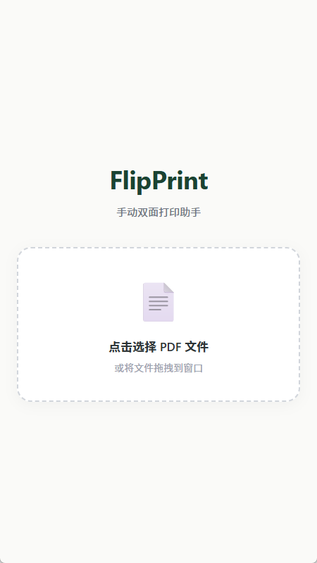
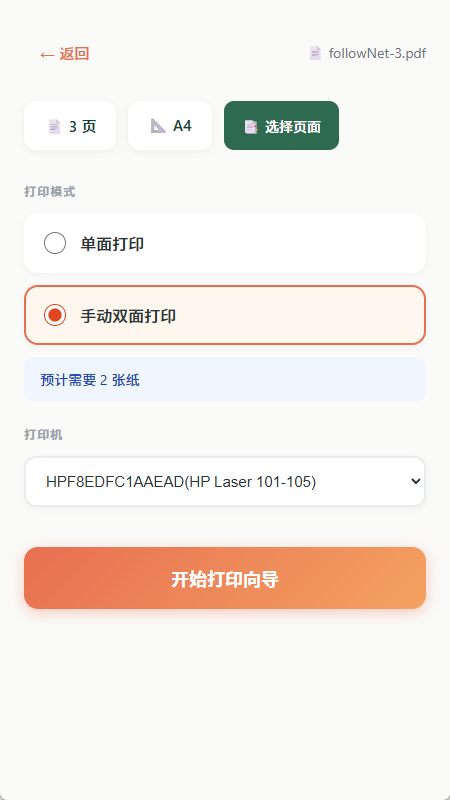

# FlipPrint

**Manual Duplex Printing Assistant** — Print double-sided documents without a duplex printer.

> Windows only · Requires SumatraPDF

---

## Features

| Feature | Description |
|---------|-------------|
| Select PDF | Drag & drop or click to select |
| Page Selection | All / Odd / Even / Invert |
| Single-Sided Print | Print selected pages directly |
| Duplex Print | Wizard: Print front → Flip → Print back |

---

## Screenshots

<div style="display: flex; gap: 24px; flex-wrap: wrap; justify-content: center;">

  <div style="text-align: center; width: 40%;">
    
    <p><em>Home Page - Select PDF file</em></p>
  </div>

  <div style="text-align: center; width: 40%;">
    
    <p><em>Print Wizard - Step-by-step guide</em></p>
  </div>

</div>

---

## Supported Printers

Currently, FlipPrint only supports the following printers:
- HP 105
- HP 105W

> Note: Other printers may work, but have not been tested.

---

## Requirements

- **OS**: Windows 10+
- **Dependency**: [SumatraPDF](https://www.sumatrapdfreader.org/free-pdf-reader)

---

## Quick Start

```bash
# Install dependencies
npm install

# Run in dev mode
npm run tauri dev

# Build for production
npm run tauri build
```

---

## Project Status

### ✅ Completed
- PDF file selection (drag & drop / dialog)
- PDF analysis (page count, paper size)
- Page selection interface
- Single-sided printing
- Duplex printing wizard
- Printer selection
- Temporary file cleanup

### 🔄 In Progress
- PDF thumbnail preview

### 📋 Planned
- Print history
- Settings persistence
- macOS/Linux support
